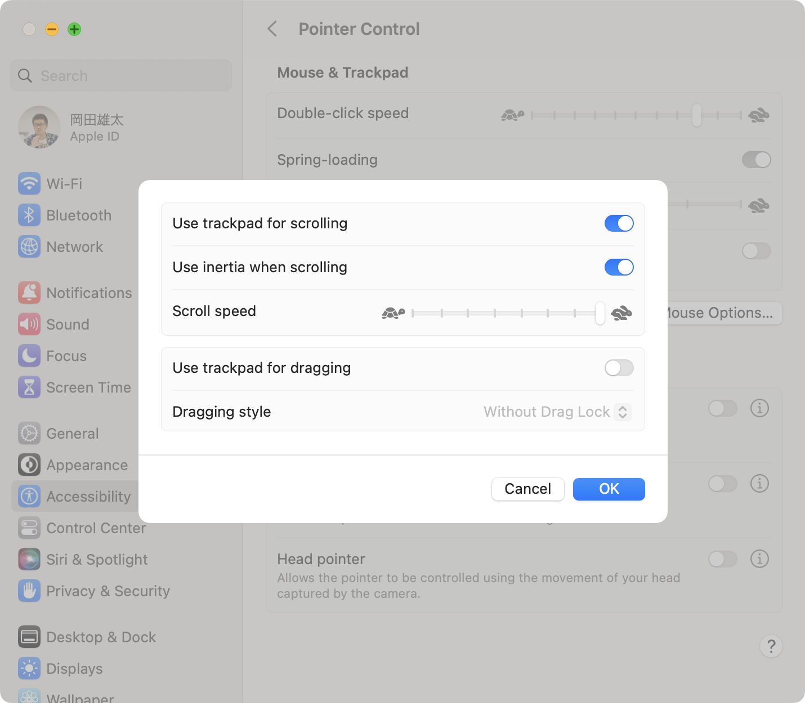

# アクセシビリティ設定

## System Settings > Accessibility

### ポインタコントロール

- `Pointer Control > Trackpad Options... > Scroll speed` を Fast に設定

### カメラオプション

- 検索欄で `camera` と入力すると `Camera Options...` が表示される
- `Camera Options...` から内蔵カメラ/外付けカメラの切り替えができる

