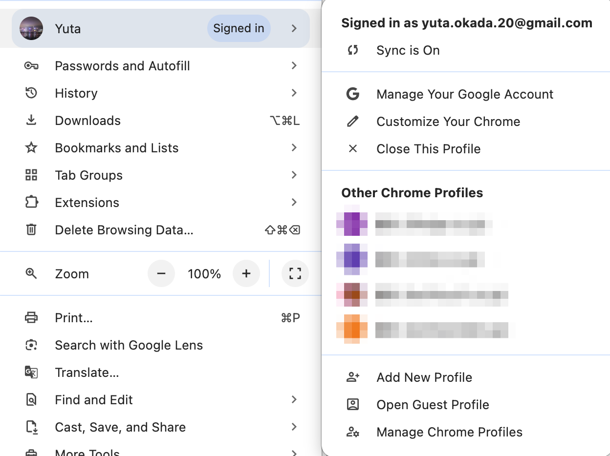

# ブラウザ

使用しているブラウザは以下のとおり。

- Google Chrome
- Comet
- ChatGPT Atlas

## Google Chrome

### Profile（プロファイル）

個人用、仕事用など、設定を分けて登録ができる。

#### プロファイルの管理

Chromeでは複数のプロファイルを作成し、それぞれ異なる設定やアカウント情報を管理できます。

**プロファイルの切り替え方法：**

1. Chromeのメニューバーから、右上のプロファイルアイコン（またはユーザー名）をクリック
2. 表示されるメニューから、使用したいプロファイルを選択

**プロファイル管理メニューの機能：**

- **現在のプロファイルの管理**
  - Manage Your Google Account（Googleアカウントを管理）
  - Customize Your Chrome（Chromeをカスタマイズ）
  - Close This Profile（このプロファイルを閉じる）

- **他のプロファイルの操作**
  - 他のプロファイルを選択して切り替え
  - Add New Profile（新しいプロファイルを追加）
  - Open Guest Profile（ゲストプロファイルを開く）
  - Manage Chrome Profiles（Chromeプロファイルを管理）

**プロファイルの活用：**

- 個人用と仕事用でプロファイルを分けることで、ブックマーク、拡張機能、履歴などを分離して管理できます
- 各プロファイルで異なるGoogleアカウントにサインインできます
- 同期機能（Sync）を有効にすることで、各プロファイルの設定をクラウドに保存・同期できます

## Comet

Chromium ベースのブラウザ。
Sidekick が Perplexity に統合され、新しくできたブラウザ。

## ChatGPT Atlas

ChatGPT のブラウザアプリケーション。
