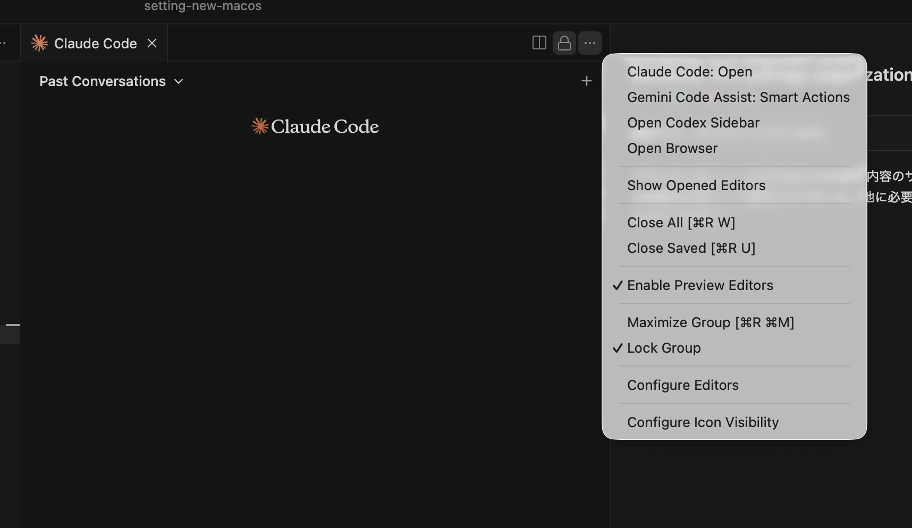

# コントロールセンター・メニューバー設定

## System Settings > Control Center

- `Bluetooth` を表示
- `Sound` を `Always Show in Menu Bar` に設定
- `Battery > Show Percentage` を ON に設定

## System Settings > Control Center（最新のOS）

最新のOSでは、コントロールセンターとメニューバーの設定が統合されています。

- `Spotlight` をオフ
- `Bluetooth` を表示
- `Battery > Show Percentage` を ON に設定
- 不要なものをオフ

