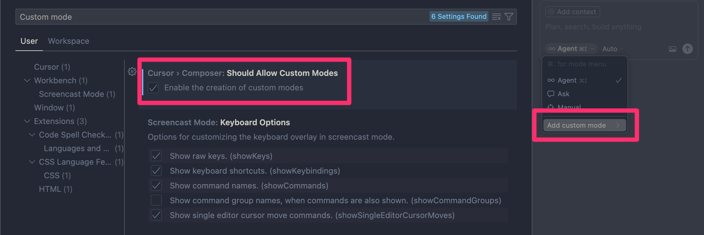

# Cursor

## 設定

`Cmd + Shift + P > Shell Command: Install 'cursor' command` を実行し、ショートカットコマンドにパスを通す。

`Cmd + Shift + P > Preferences: Open User Settings (JSON)` で settings.json を開き、[設定例](https://github.com/dhythm/config-public/blob/master/cursor/settings.json)を参考に更新する。

## 拡張

[インストールされた拡張一覧](https://github.com/dhythm/config-public/blob/master/cursor/extensions.txt)

## Vim モードで長押しが効かない場合

下記を実行し、Cursor を再起動すると有効化する。

```sh
osascript -e 'id of app "Cursor.app"'
defaults write <表示されたドメイン名> ApplePressAndHoldEnabled -bool false
```

## Custom Mode の有効化



## 参考リンク
