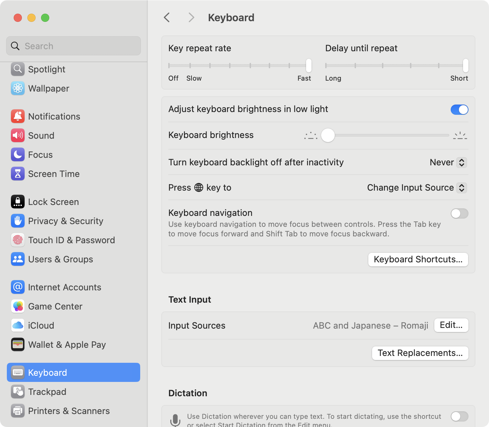
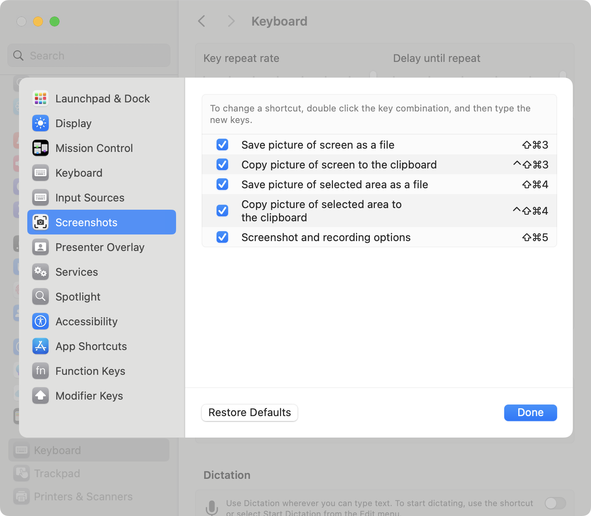
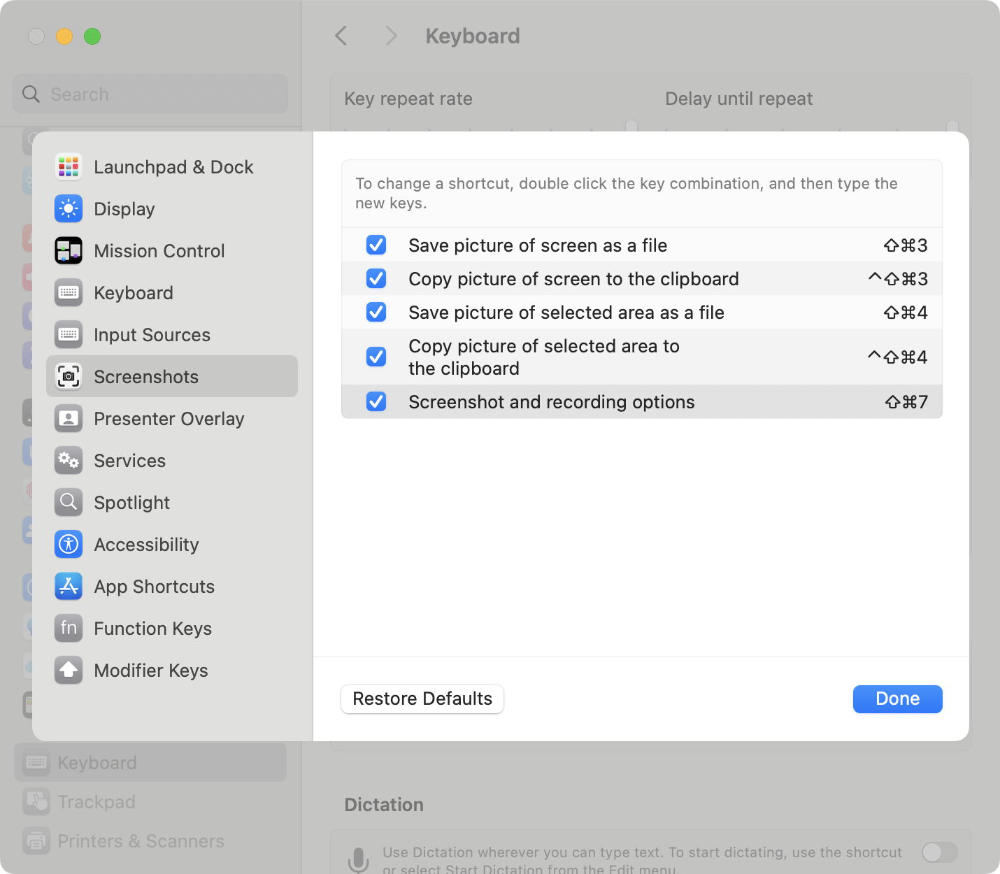

# 画像編集ツール

## Skitch

画面キャプチャ、テキストや枠の追加、モザイク加工等が手軽にできる画像編集ツール。

### ダウンロード

https://apps.apple.com/jp/app/id425955336?mt=12

### キーバインド

`⇧⌘5` が Mac 標準の画面キャプチャオプションと被っている。
Skitch 側は修正できないため、Mac 側の設定を変える必要がある。

`Settings > Keyboard > Keyboard Shortcuts > Screenshots` にて、Mac 側の設定を `⇧⌘7` に変更することで重複を避ける。

## Gapplin

画像ビューア・編集ツール。

### ダウンロード

https://apps.apple.com/jp/app/gapplin/id768053424?mt=12

## ToyViewer

画像ビューア・編集ツール。機能としては上位だが、現状は使用していない。
Skitch のモザイク加工で代替できており、高度な加工は不要。

### ダウンロード

https://apps.apple.com/jp/app/toyviewer/id414298354?l=en-US&mt=12
