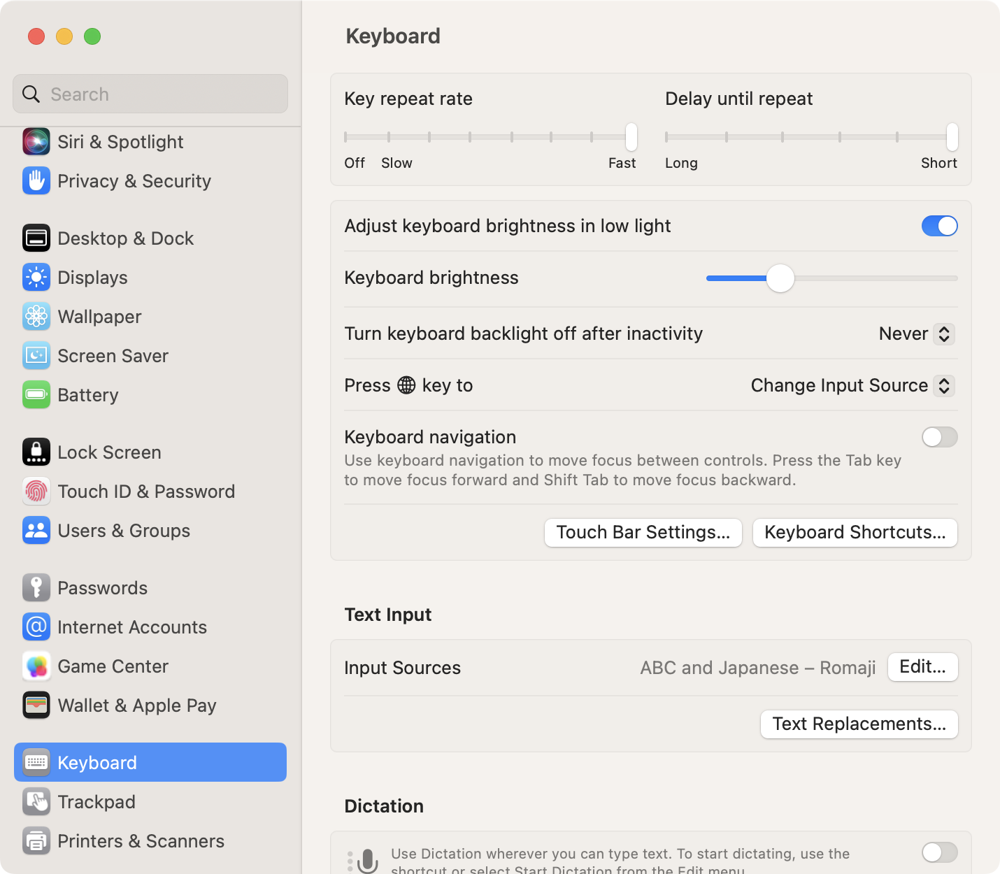
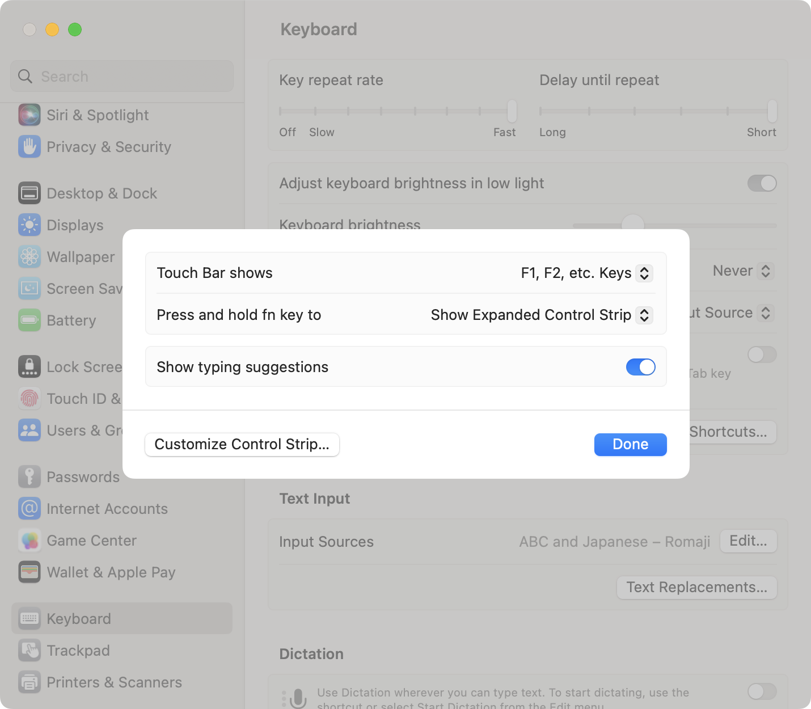
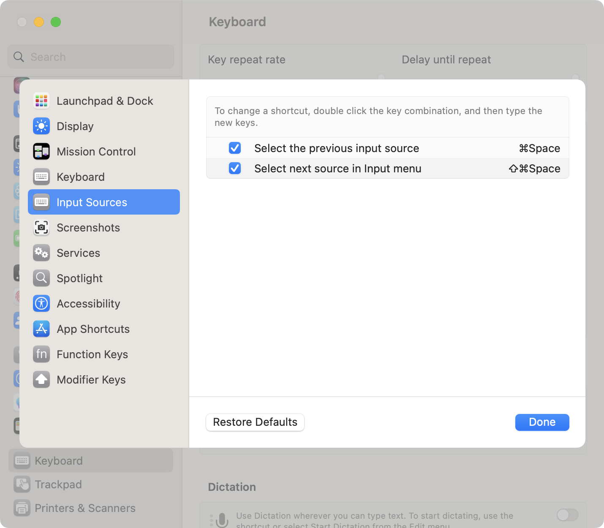
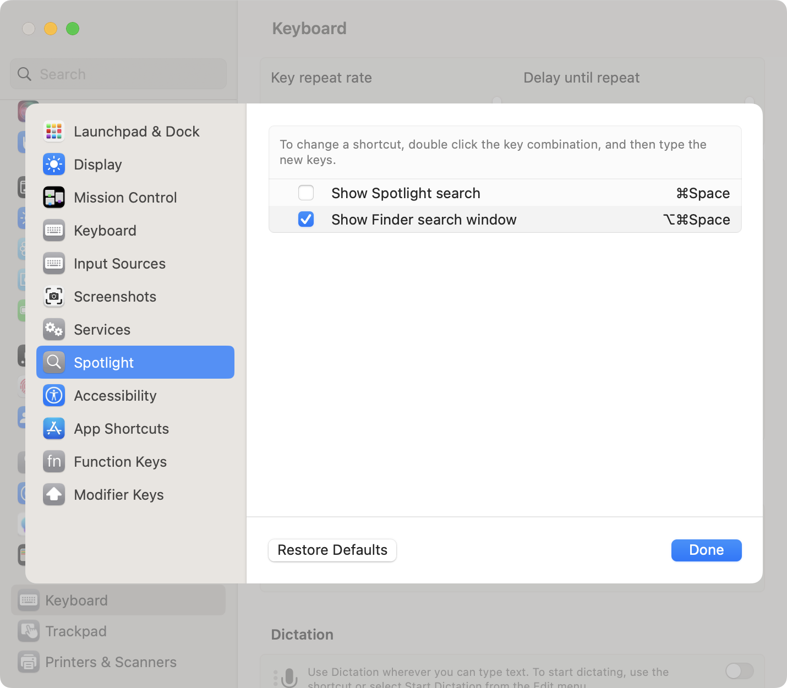

# キーボード設定

## System Settings > Keyboard

- `Key repeat rate` を Fast に設定
- `Delay until repeat` を Short に設定
- `Keyboard Shortcuts... > Input Sources` で `Select the previous source in Input menu` を `Cmd + Space` に変更
- `Keyboard Shortcuts... > Input Sources` で `Select next source in Input menu` を `Cmd + Shift + Space` に変更
- `Keyboard Shortcuts... > Spotlight` で `Show Spotlight search` を無効化
- `Keyboard Shortcuts... > Modifier Keys` で `Caps Lock key` を `Control` に変更

