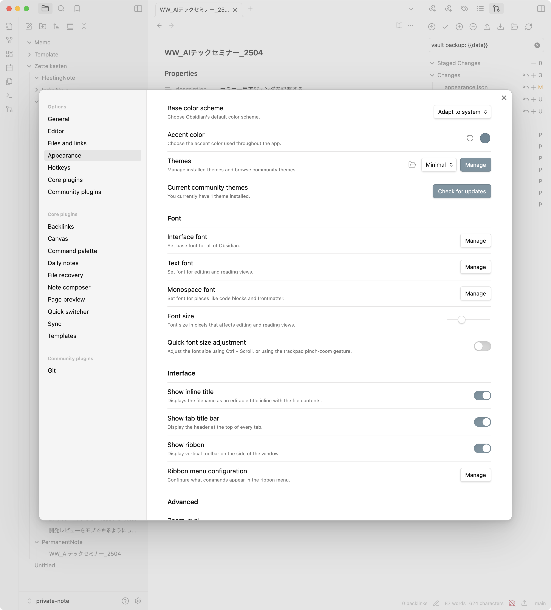
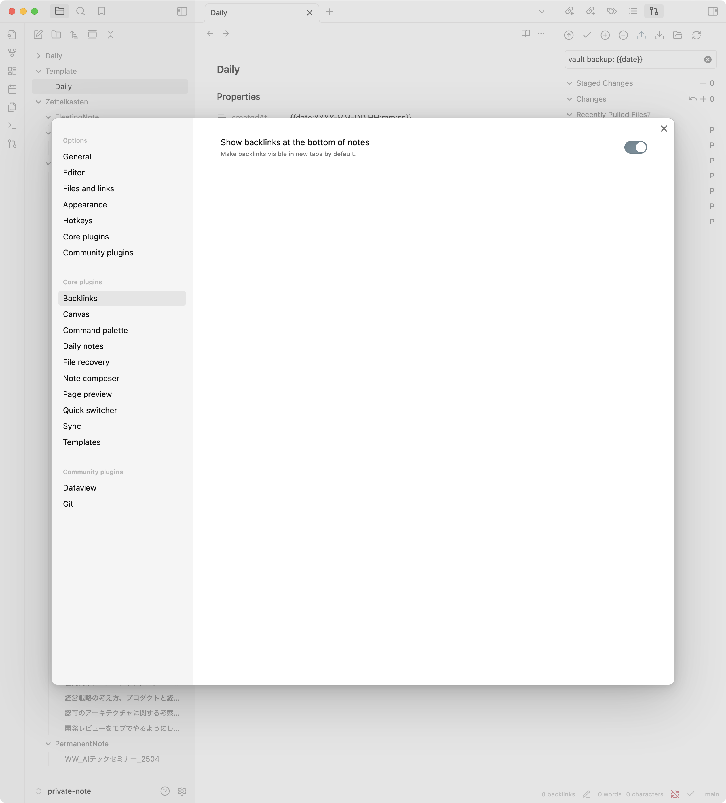
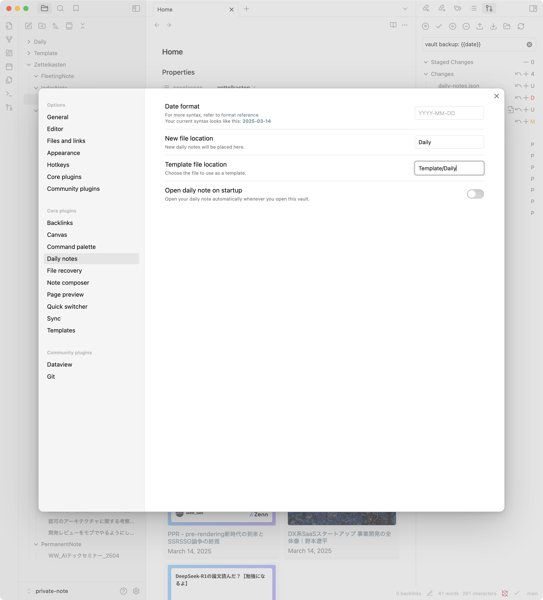
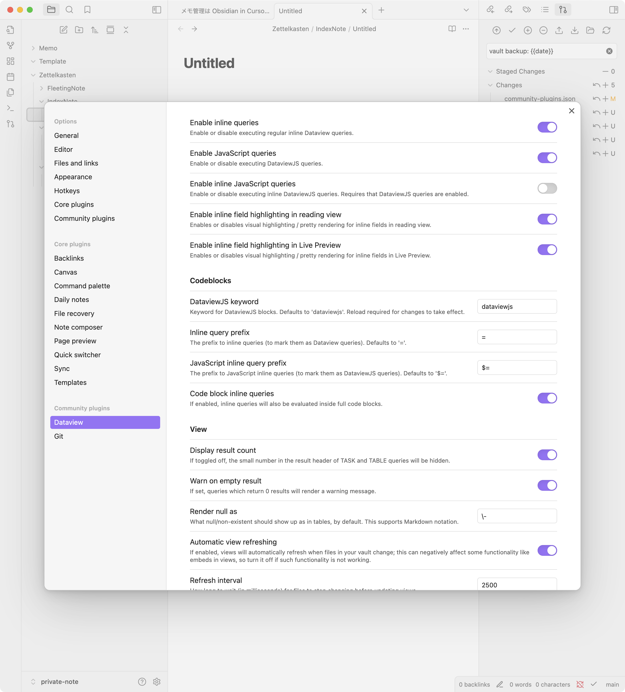

# Obsidian

思考整理ツール。個人用の Notion に近い。

## ディレクトリ構成

```
.
├── Zettelkasten/
│   ├── FleetingNote/
│   ├── IndexNote/
│   ├── LiteratureNote/
│   ├── PermanentNote/
│   └── Zettelkastenの運用/
├── Memo/
└── Template/
```

## 設定

### Themes

人気のある Minimal に変更。



### Backlinks



### Daily Notes



### CSS snippets の使い方

`.obsidian/snippets` に CSS ファイルを配置する。
`Settings > Appearance > CSS Snippets` で CSS ファイルを有効化する。


## Tools

### [obsidian-web-clipper](https://chromewebstore.google.com/detail/obsidian-web-clipper/cnjifjpddelmedmihgijeibhnjfabmlf)

任意のページを保存するための Chrome 拡張。
保存先を設定し、プロパティを追加して画像のパスを設定する。


### [obsidian-git](https://github.com/Vinzent03/obsidian-git)


https://publish.obsidian.md/git-doc/Getting+Started
Git を使うための[認証設定](https://publish.obsidian.md/git-doc/Authentication#macOS)を行う。

```sh
git config --global credential.helper osxkeychain
```

自動コミット・プッシュを有効化し、コミット・プルの間隔を設定する。


### [Dataview](https://github.com/blacksmithgu/obsidian-dataview)

`Enable JavaScript Queries` をオンにする。



````
```dataviewjs
dv.table(
  ["画像", "ノート", "作成日"],
  dv.pages("#clippings")
    .sort(b => b.file.cday, 'desc')
    .map(b => {
      console.log(b)
      return [
        b.image ? ("") : "画像なし",
        b.file.link,
        b.file.cday
      ]
    })
)
```
````

### [Multi-column Markdown](https://github.com/ckRobinson/multi-column-markdown)

## 参考

- [メモ管理は Obsidian in Cursor が最強](https://note.com/shotovim/n/na1d91f10c1d0)
- [単なるメモから知的資産へ：Obsidian in Cursor で構築する知的生産システム](https://note.com/shotovim/n/n5833578984bf)
