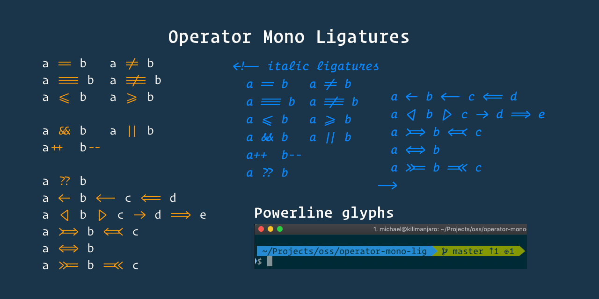

# Operator Mono Ligatures



## 準備

```sh
brew install fonttools
```

## インストール

Operator Mono のオリジナルフォントを[ダウンロード](https://github.com/festackcode/dev-fonts)。
ダウンロードしたフォントから[手順](https://github.com/kiliman/operator-mono-lig)にしたがって Operator Mono Lig を生成。
