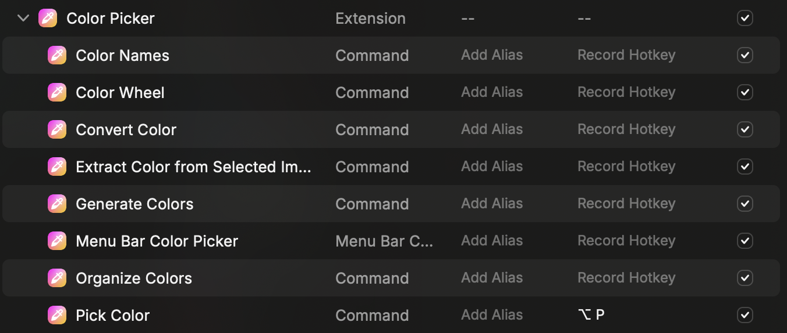

# Raycast

## 設定

- `General > Reycast Hotkey` を `Ctrl + Space` に変更

## Extensions

### [Color Picker](https://www.raycast.com/thomas/color-picker)

Hotkey を設定（`⌘ + P`）

### [Google Search](https://www.raycast.com/mblode/google-search)

### [Image Modification](https://www.raycast.com/HelloImSteven/sips)

### [Installed Extensions](https://www.raycast.com/pernielsentikaer/installed-extensions)

### Clipboard History

標準でインストールされている。
Hotkey を設定（`⌘ + ⌘`）

### Calender

標準でインストールされている。
カレンダーを同期させることで、Zoom / Meets など、予定に登録されているオンライン会議に直接参加できる。

### Search Emoji & Symbols

標準でインストールされている。

## 参考リンク

- [Raycast のおすすめ設定:Alfred・Clipy ユーザーに試してほしい!](https://zenn.dev/jonghyo/articles/raycast-settings)
