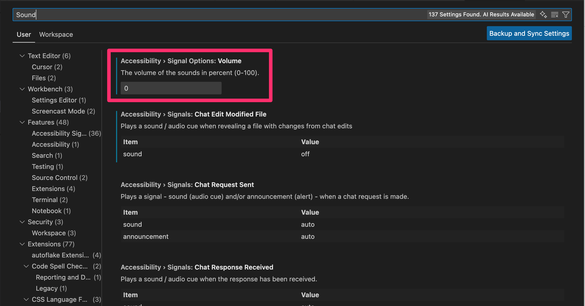

# VS Code

## 設定

サイドバーから `EXPLORER > Open Editors` をチェックし、開いているファイルを表示する。

`Cmd+Shift+P > Shell Command: Install 'code' command PATH` を実行し、ショートカットコマンドにパスを通す。

`Cmd + Shift + P > Preferences: Open User Settings (JSON)` で settings.json を開き、[設定例](https://github.com/dhythm/config-public/blob/master/vscode/settings.json)を参考に更新する。
`vscode-neovim.neovimExecutablePaths.darwin` には `which nvim` で取得したパスを設定する。

### Keybindings

- [VSCodeVim を使う場合](https://github.com/dhythm/config-public/blob/master/vscode/keybindings.json)
- [VSCode Neovim を使う場合](https://github.com/dhythm/config-public/blob/master/nvim/keybindings.json)

### Sounds

## Extensions

[拡張一覧](https://github.com/dhythm/config-public/blob/master/vscode/extensions.txt)
