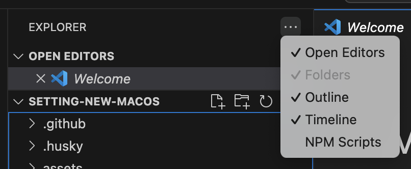

# VSCode

## 設定

### 開いているファイルを表示する

サイドバーから `EXPLORER > Open Editors` をチェック。

### code コマンドの有効化

`Cmd+Shift+P > Shell Command: Install 'code' command PATH` を実行。

### settings.json

[設定例](https://github.com/dhythm/config-public/blob/master/vscode/settings.json)

- `vscode-neovim.neovimExecutablePaths.darwin` に `which nvim` で取得したパスを設定する
- `terminal.integrated.fontFamily` にターミナルで設定しているフォントを指定する

### Keybindings

- [VSCodeVim を使う場合](https://github.com/dhythm/config-public/blob/master/vscode/keybindings.json)
- [VSCode Neovim を使う場合](https://github.com/dhythm/config-public/blob/master/nvim/keybindings.json)

### Extensions

[拡張一覧](https://github.com/dhythm/config-public/blob/master/vscode/extensions.txt)
